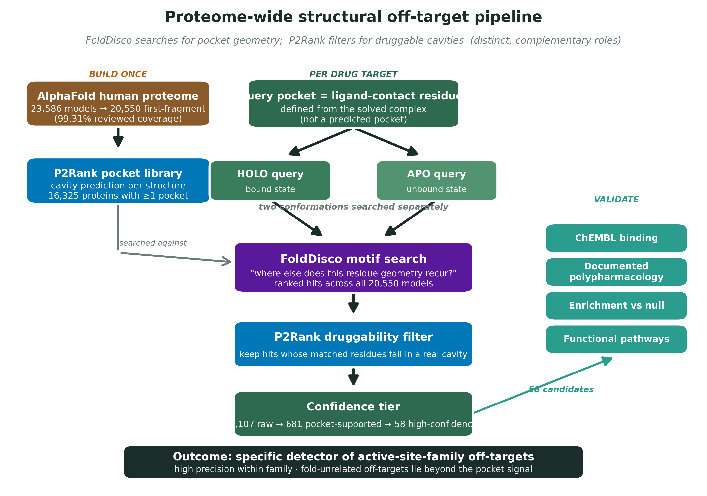
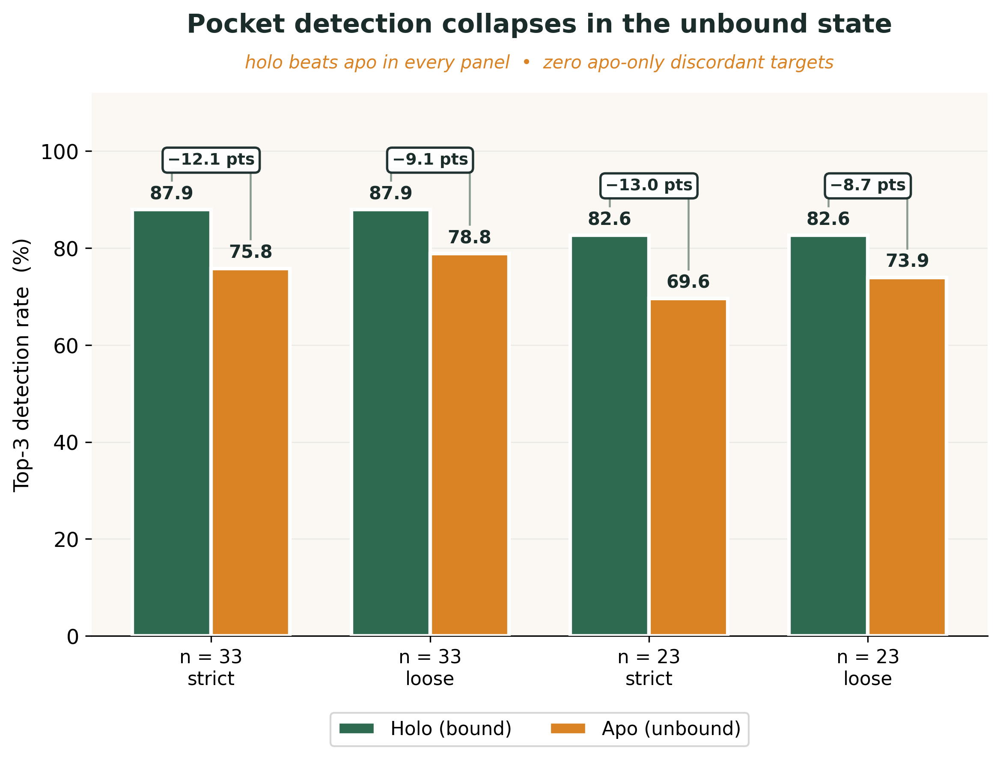
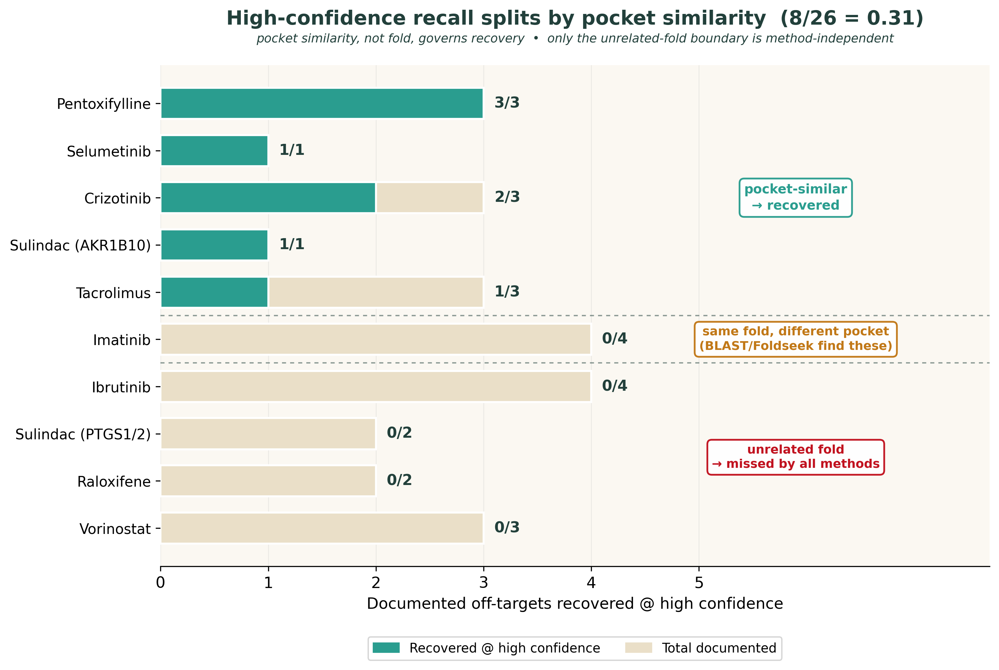
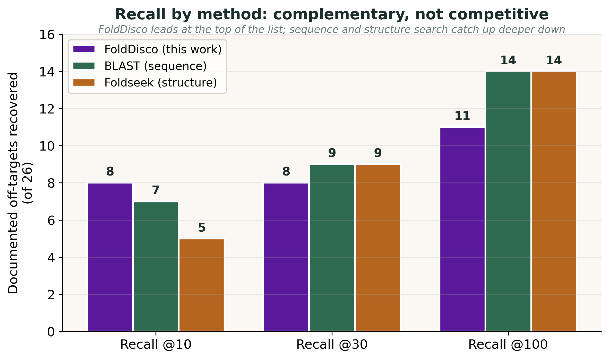

# 🧬 Proteome-Wide Structural Prediction of Drug Off-Targets

A structural bioinformatics framework that predicts drug off-targets by searching the entire human AlphaFold proteome for recurrences of a drug's binding-pocket geometry, using FoldDisco for motif search and P2Rank as an orthogonal druggability filter, validated against measured binding data.

---


**Researcher:** Mirza Muhammad Hasan Ali

**Academic Institution:** Stockholm University / SciLifeLab

**Programme:** MSc Bioinformatics

**Supervisor:** Prof. Arne Elofsson

---

## 🚀 1. Getting Started & Reproducibility

This section outlines the setup, dependencies, and data layout needed to reproduce the pipeline end to end.

### 📋 Environment setup

Clone the repository and enter the project directory:

```bash
git clone https://github.com/hasanmirza72/proteome-wide-off-target-pipeline
cd proteome-wide-off-target-pipeline
```

### 📦 Dependency installation

Install the Python dependencies from the unified manifest:

```bash
pip install -r requirements.txt
```

### 🛠️ External tools

Four external tools must be installed separately and available on your `PATH`. Their exact versions are documented in Section 7.

```
FoldDisco (commit de68e15)   ·   P2Rank 2.4.2   ·   BLAST+ 2.17.0+   ·   Foldseek 10
```

### 📊 Data staging

To keep the repository lightweight, large inputs are decoupled from source control:

- **AlphaFold proteome:** download the human proteome from the [AlphaFold Protein Structure Database](https://alphafold.ebi.ac.uk/), then run Stage 2 to build the library.
- **Result tables:** the small tables reported in the thesis are provided under `results/` so the numbers can be inspected without re-running the pipeline.

---

## 🏗️ 2. Project Layout & Structure

The repository is modularized by pipeline stage, separating dataset construction, library building, search, filtering, analysis, validation, and baselines.

```
proteome-offtarget-pipeline/
├── requirements.txt              # Python dependencies with exact versions
├── .gitignore                    # Excludes large structures, indexes, and caches
├── README.md                     # This document
│
├── scripts/
│   ├── 01_dataset/               # 🗂️ Benchmark construction and curation
│   │   ├── sider_pdb_miner.py         # Mine drug-bound human structures (RCSB + SIDER + openFDA + PubChem)
│   │   ├── ahoj_apo_miner.py          # Retrieve matching apo (unbound) structures via AHoJ
│   │   ├── clean_pairs.py             # Apply ligand, quality, and redundancy curation filters
│   │   ├── finalize_dataset.py        # Final curation, Wilson CIs, exclusions -> 23 targets
│   │   ├── verify_all_targets.py      # Ground-truth pocket labeller (true binding site per target)
│   │   └── check_quaternary_site.py   # Flag interface pockets a monomer model cannot represent
│   │
│   ├── 02_library/               # 🧱 AlphaFold library and P2Rank pockets
│   │   ├── library_20550_fasta.py     # Extract sequences for the 20,550 proteome models
│   │   ├── strip_ligands.py           # Build computationally-apo inputs for P2Rank
│   │   ├── build_library_pockets.py   # Flatten P2Rank predictions into the pocket library
│   │   └── analyze_top3_pockets.py    # Holo vs apo pocket detection analysis
│   │
│   ├── 03_search/                # 🔍 FoldDisco motif search
│   │   ├── build_queries_manifest.py  # Build ligand-contact-residue query motifs
│   │   ├── run_self_recovery.sh       # FoldDisco self-recovery positive control
│   │   ├── run_offtarget.sh           # FoldDisco proteome-wide off-target search
│   │   ├── summarize_self_recovery.py # Self-recovery rank summary
│   │   └── evaluate_predictions_nonredundant.py  # Detection result (n = 23)
│   │
│   ├── 04_filter/                # 🧪 Pocket support and confidence tiers
│   │   └── offtarget_overlap_filter.py  # 1,107 raw -> 681 supported -> 58 high-confidence
│   │   └── sensitivity_analysis.py      # Threshold sensitivity: how the 58 responds to each cutoff
│   │
│   ├── 05_analysis/              # 📐 Conformational analysis
│   │   ├── dual_query_divergence.py   # Holo/apo hit-list divergence (Spearman + permutation)
│   │   └── redundant_robustness.py    # Robustness to the query-defining drug
│   │
│   ├── 06_validation/            # 🔬 Biological validation (four probes)
│   │   ├── phase5_annotate.py         # ChEMBL / SIDER / openFDA annotation layer
│   │   ├── phase5_recall.py           # Documented off-target recall
│   │   ├── phase5_enrichment_null.py  # Enrichment vs a pocket-matched null
│   │   ├── phase5_pathways.py         # GO / KEGG / Reactome enrichment via Enrichr
│   │   └── phase5_summary.py          # Consolidated validation verdict
│   │
│   ├── 07_baselines/             # ⚖️ Sequence and structure baselines
│   │   ├── run_blast.sh               # BLAST+ sequence-similarity baseline
│   │   ├── run_foldseek.sh            # Foldseek structure-similarity baseline
│   │   └── extract_raw_ranks.py       # Raw FoldDisco ranks for a fair comparison
│   |   └── score_baselines.py         # Computes the FoldDisco/BLAST/Foldseek baseline comparison
|   |
│   ├── figures/                  # 📊 Figure generation
│   ├── utils/                    # 🧰 Audit and verification helpers
│   └── archive/                  # 🗃️ Superseded iterations (kept for provenance)
│
├── results/                      # Small result tables reported in the thesis
├── supplementary_data/           # 🗄️ Datasets behind every table and figure (+ data dictionary)
└── docs/                         # Full ordered pipeline walkthrough
```

---

## 📝 3. Abstract & Problem Statement

Drugs rarely act on a single target. Predicting which *other* human proteins a drug may bind (its off-targets) is central to understanding side effects and repurposing opportunities. Structure-based off-target prediction faces three challenges:

1. **Sequence search misses structural neighbours.** Two proteins can share a binding-pocket shape without sharing sequence, so sequence-similarity tools overlook geometrically similar sites.

2. **A predicted cavity is not a match.** Detecting that a protein *has* a pocket does not establish that the pocket resembles the drug's binding site; the two questions must be separated.

3. **Conformational state changes the answer.** The same protein queried in its bound (holo) versus unbound (apo) form can return very different candidate lists.

This framework addresses all three. **FoldDisco** searches the human AlphaFold proteome for recurrences of a drug's ligand-contact residue geometry; **P2Rank** is applied only as an orthogonal filter confirming each match sits in a genuine cavity. The pipeline is benchmarked on 23 non-redundant drug-target pairs, measures the holo/apo effect directly, and validates predictions against ChEMBL binding data, documented polypharmacology, enrichment versus a matched null, and pathway analysis. The result is a short, high-precision list of within-family off-target candidates, with the method's boundaries quantified honestly against BLAST and Foldseek baselines.




> **Figure 1.** Overview of the pipeline. The AlphaFold library and P2Rank pocket library are built once; each drug is queried in its holo and apo conformations; FoldDisco searches for recurring pocket geometry and P2Rank filters the matches to genuine cavities; a confidence tier reduces 1,107 raw matches to 58 candidates, which four biological probes validate.

---

## 📂 4. Dataset Breakdown

- **Query set:** 40 candidate holo/apo drug-target pairs, curated to **23 non-redundant targets** across seven target classes (kinases, hydrolases, phosphodiesterases, nuclear receptors, reductases, and others)

- **Search library:** the human AlphaFold proteome reduced to **20,550 first-fragment models** (99.31% of the reviewed proteome), with a P2Rank pocket library covering the **16,325** proteins that carry at least one predicted cavity.

- **Ground truth:** documented off-targets compiled from ChEMBL mechanism records and the primary literature, used only for validation and never seen by the search.

---

## 🛠️ 5. Methodology: The Pipeline

### 🗂️ 5.1 Benchmark construction

Drug-bound human structures are mined from the RCSB PDB and confirmed as clinical drugs through SIDER and openFDA (via PubChem). Matching apo structures are retrieved with AHoJ. Curation filters remove unsuitable ligands, poor structural correspondence, and redundancy, producing the final non-redundant set of 23 targets.

### 🧱 5.2 Library and pocket construction

The AlphaFold human proteome is reduced to one first-fragment model per accession (20,550 models). P2Rank is run over the library to build a pocket table; the 16,325 proteins with at least one predicted cavity form the searchable pocket library.

### 🔍 5.3 FoldDisco motif search

Each drug supplies a query defined by its ligand-contact residues (within 4.0 Å of the ligand). FoldDisco searches this residue-geometry motif against the whole library, returning ranked matches by an inverse-document-frequency (IDF) rarity weight. Each target is searched in both its holo and apo conformations so the effect of conformation can be measured directly.

### 🧪 5.4 Filtering to high-confidence candidates

FoldDisco's raw matches pass through P2Rank as an orthogonal filter: only matches whose residues fall inside a genuine predicted cavity are retained, then a confidence tier reduces the set further. The funnel runs **1,107 raw -> 681 pocket-supported -> 58 high-confidence** candidates. The confidence tier requires at least four matched residues, at least three inside the pocket, an overlap fraction of at least 0.30, an RMSD at or below 2.0 Å, and a FoldDisco IDF of at least 3.0. A threshold sensitivity analysis (scripts/04_filter/sensitivity_analysis.py) confirms the count responds smoothly to each threshold, with the chosen values sitting in the interior of each range rather than at a cliff edge.

### 🔬 5.5 Biological validation

The 58 candidates are tested four independent ways: measured ChEMBL binding, recall of documented off-targets, enrichment for known drug targets against a pocket-matched null, and functional pathway enrichment. All statistical tests (McNemar exact, Fisher exact, Spearman) are implemented directly in NumPy with permutation p-values.

---

## 🔬 6. Results & Performance Audit

### 🏆 6.1 Headline results

| Metric | Value |
|--------|-------|
| Benchmark targets (non-redundant) | **23** |
| Proteome models searched | **20,550** |
| Self-recovery (positive control) | **23 / 23** targets recovered |
| Off-target funnel | **1,107 → 681 → 58** |
| High-confidence hits within-family | **86%** |
| Enrichment for known drug targets | **5.1×** (Fisher *p* = 2.6 × 10⁻⁶) |

### 📉 6.2 The conformational effect

Pocket detection collapses in the unbound state: **holo 82.6%** versus **apo 69.6%** top-3 detection, a systematic one-directional gap confirmed by an exact McNemar test. The holo and apo queries return near-disjoint hit lists (median Jaccard **0.066**), showing that conformational state materially changes the predicted off-target set.



> **Figure 2.** Pocket detection collapses in the unbound (apo) state across both benchmark sets and both distance thresholds. Holo exceeds apo in every panel.


### 🎯 6.3 Recall of documented off-targets

FoldDisco's high-confidence recall of documented off-targets is governed by pocket similarity. Off-targets that share the query's binding pocket are recovered; those that do not are missed, even when they share the same fold. Overall high-confidence recall is **8 of 26** documented off-targets.



> **Figure 3.** Off-targets that share the query's pocket are recovered (for example pentoxifylline 3/3, selumetinib 1/1); those that do not are missed, whether they occupy the same fold with a different pocket (imatinib 0/4) or an unrelated fold (ibrutinib 0/4). Overall high-confidence recall is 8/26.

### ⚖️ 6.4 Baseline comparison against BLAST and Foldseek

The pipeline is benchmarked against two established sequence- and structure-similarity methods, BLAST+ and Foldseek. The three are **complementary rather than competitive**: FoldDisco ranks pocket-similar off-targets highest, while sequence and structure search give broader fold-level recall. Critically, at recall@100 **all three methods recover zero fold-unrelated off-targets**, a biological boundary that is method-independent rather than a limitation specific to this pipeline. The comparison establishes complementarity, not superiority; FoldDisco is best read as a precision-oriented addition to sequence and structure search, not a replacement for them.



> **Figure 4.** Documented off-target recall by method at three rank cutoffs (of 26 documented targets). FoldDisco leads at the top of the ranked list (8 at recall@10 versus 7 and 5), while BLAST and Foldseek recover more deeper down (14 each at recall@100 versus 10). The methods are complementary: FoldDisco favours precision, the global methods favour breadth.

---

## 📌 7. Software & Database Versions

Exact versions are documented for full reproducibility. Live web services were queried in July 2026.

| Tool | Version | Role |
|------|---------|------|
| FoldDisco | commit de68e15 | structural motif search |
| P2Rank | 2.4.2 | pocket detection and filter |
| BLAST+ | 2.17.0+ | sequence baseline |
| Foldseek | 10 (10.941cd33) | structure baseline |
| PyMOL | 3.1.0 | structural superposition |
| Python | 3.12.x (Numpy 2.2.6, Pandas 2.3.3, Biopython 1.87) | pipeline and statistics |
| Matplotlib | 3.10.8 | figure rendering

**Databases:** AlphaFold DB (file v6), RCSB PDB, ChEMBL, UniProt (2025), PubChem, SIDER 4, openFDA, and Enrichr (GO_Biological_Process_2023, KEGG_2021_Human, Reactome_2022).

---

## ⚠️ 8. Limitations & Future Work

The benchmark quantifies the method's boundaries honestly:

- **Interface pockets.** The monomeric, first-fragment library cannot represent binding sites formed across subunit interfaces (for example, the NUDT1 homodimer). Extending the library to homodimers and multimers is the clearest next step.

- **Within-family scope.** The method is a specific detector of active-site-family off-targets. Off-targets on unrelated folds lie beyond the pocket-geometry signal and are not recovered by any method tested.

- **Study bias.** Enrichment is measured against pocket-bearing proteins; a family-matched background would further separate genuine signal from the tendency of well-studied families to be both drugged and annotated.

Future directions include a combined FoldDisco + sequence/structure pipeline for both precision and fold-level recall, an identity-fixed conformational control, and prospective application to drugs with solved binding poses.

---

## 🏁 9. Conclusion

A structural pocket-similarity search across the human proteome can recover independently confirmed drug off-targets, provided the predictions are read within the scope of structurally related targets the method is designed to find. By separating the two questions the field often conflates (does a pocket exist, and does it resemble the query), and by validating against measured binding rather than structure alone, this pipeline delivers a short, high-precision, and honestly-bounded list of off-target candidates. The contribution is a working, fully documented pipeline whose performance is demonstrated and whose limitations are quantified.

---

## 🗄️ 10. Supplementary Data

The datasets underlying every table and figure in the thesis are provided under [`supplementary_data/`](supplementary_data/), so the results can be inspected and verified without re-running the pipeline. Each file maps to a specific thesis table or figure, and column definitions are given in `supplementary_data/DATA_DICTIONARY.md`.

| File | Description | Thesis reference |
|------|-------------|------------------|
| `dataset_final_nonredundant.csv` | The 23 non-redundant benchmark targets | Table 4 |
| `dataset_excluded.csv` | Curation exclusions with reasons | Table 2 |
| `p2rank_evaluation.csv` | Per-target P2Rank detection (holo and apo) | Table 3, Table 4 |
| `self_recovery_summary.tsv` | FoldDisco self-recovery ranks | Table 9, Table 10 |
| `folddisco_raw_hits.tsv` | All raw FoldDisco geometric matches | Section 5.2 |
| `offtarget_hits_high.tsv` | The 58 high-confidence candidates | Table 7, Table 8 |
| `offtarget_hits_bioannotated.tsv` | High-confidence hits with ChEMBL annotation | Table 13, Table 14 |
| `dual_query_divergence.tsv` | Holo/apo divergence vs conformational axes | Table 5, Figures 3-4 |
| `phase5_recall.tsv` | Documented off-target recall | Table 15 |
| `phase5_enrichment_null.tsv` | Enrichment against a matched null | Table 16 |
| `phase5_pathways.tsv` | GO / KEGG / Reactome enrichment | Table 17 |
| `blast_hits.tsv`, `foldseek_hits.tsv` | Baseline comparison results | Tables 11-12 |

All files are plain tab- or comma-separated tables that open in Excel, R, or Python. Large binary inputs (structures, search indexes, API caches) are excluded by design and are regenerable from the pipeline.

---

## 📖 Citation & License

This repository accompanies the MSc thesis *Proteome-Wide Structural Prediction of Drug Off-Targets* (Stockholm University / SciLifeLab). If you use it, please cite the thesis and the underlying tools (FoldDisco, P2Rank, BLAST+, Foldseek).

Released under the **MIT License** (see `LICENSE`). External tools carry their own licenses; FoldDisco is GPL-3.0.
